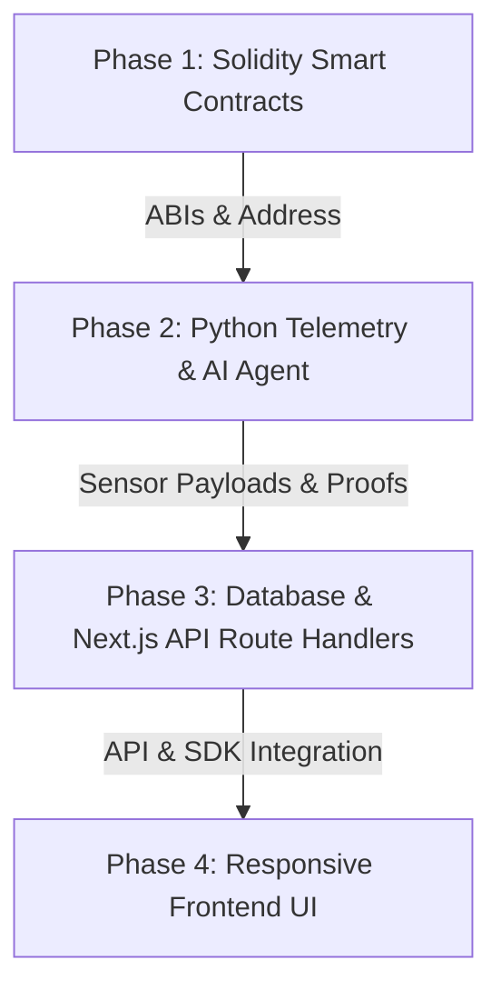

# IndustriLease: Codebase Assessment & Gap Analysis

An inspection of the workspace `/home/dayshift/Documents/cms/equipshare` reveals that the repository structure is successfully bootstrapped, but all core components exist as **empty files or directories**. Below is a file-by-file status report, architectural gap analysis, and a structured implementation roadmap.

---

## 🔍 Codebase Completeness Status

The following table summarizes the status of all files in the project workspace:

| Path | Description / Purpose | Status | Current Size / State |
| :--- | :--- | :--- | :--- |
| [`contracts/MachineSlotToken.sol`](file:///home/dayshift/Documents/cms/equipshare/contracts/MachineSlotToken.sol) | ERC-1155 / ERC-3525 Time-Slot Token contract | 🔴 **Empty** | `0 bytes` (Blank placeholder) |
| [`contracts/IndustriLeaseEscrow.sol`](file:///home/dayshift/Documents/cms/equipshare/contracts/IndustriLeaseEscrow.sol) | SME payment locking & telemetry-based settlement | 🔴 **Empty** | `0 bytes` (Blank placeholder) |
| [`backend-python/simulator.py`](file:///home/dayshift/Documents/cms/equipshare/backend-python/simulator.py) | Telemetry simulation & cryptographic telemetry proof generator | 🔴 **Empty** | `0 bytes` (Blank placeholder) |
| [`backend-python/agent.py`](file:///home/dayshift/Documents/cms/equipshare/backend-python/agent.py) | Factory AI Agent executing on-chain listings & relaying proofs | 🔴 **Empty** | `0 bytes` (Blank placeholder) |
| [`backend-python/requirements.txt`](file:///home/dayshift/Documents/cms/equipshare/backend-python/requirements.txt) | Python dependencies | 🔴 **Empty** | `1 byte` (No contents) |
| [`app/api/slots/`](file:///home/dayshift/Documents/cms/equipshare/app/api/slots) | API route: listing & fetching slots | 🔴 **Empty** | Directory is empty |
| [`app/api/machine/`](file:///home/dayshift/Documents/cms/equipshare/app/api/machine) | API route: payload encryption handling | 🔴 **Empty** | Directory is empty |
| [`app/api/escrow/`](file:///home/dayshift/Documents/cms/equipshare/app/api/escrow) | API route: proof verifier & settlement relay | 🔴 **Empty** | Directory is empty |
| [`db/`](file:///home/dayshift/Documents/cms/equipshare/db) | Prisma ORM configurations and database files | 🔴 **Empty** | Directory is empty |
| [`lib/`](file:///home/dayshift/Documents/cms/equipshare/lib) | Shared utility modules & Web3 helper setups | 🔴 **Empty** | Directory is empty |
| [`package.json`](file:///home/dayshift/Documents/cms/equipshare/package.json) | Node dependency management | 🟡 **Stock Template** | Only contains stock `Next.js 16.2.12` and standard packages. No database tools or Web3 client libraries. |
| [`app/page.tsx`](file:///home/dayshift/Documents/cms/equipshare/app/page.tsx) | Homepage frontend entrypoint | 🟡 **Stock Template** | Standard Next.js boilerplate template. |

---

## ⚡ Architectural Gap Analysis

### 1. Smart Contracts Layer (Solidity)
- **Token Contract (`MachineSlotToken.sol`)**: Needs to represent time-slot assets. The spec outlines using ERC-1155 or ERC-3525. For time slots (which have distinct attributes like start/end time, hourly rate, and machine ID but are semi-fungible in nature), **ERC-1155** is highly standard, lightweight, and supported by OpenZeppelin out-of-the-box, though ERC-3525 provides a native double-grid (ID & slot & value) model.
- **Escrow Contract (`IndustriLeaseEscrow.sol`)**: Needs functions to deposit/lock funds, release funds on telemetry proof cryptographic verification, and initiate refunds if a partial run fails.
- **Development Tooling**: We lack a Solidity compile/test framework (e.g., Hardhat or Foundry). We will need to set this up to compile contracts and generate TypeScript typings/ABIs.

### 2. Python Backend Layer
- **Simulator (`simulator.py`)**: Needs an asynchronous loop or API endpoints (e.g., using FastAPI) to mock machine metrics (temperature, layer height, speed, status: `IDLE`, `RUNNING`, `ERROR`, `COMPLETED`). On completion, it must sign a telemetry proof string using the machine's private key.
- **AI Agent (`agent.py`)**: Needs to monitor simulator status, call the blockchain to mint slots using a Web3 session key (ERC-7579/ERC-4337 or direct EOA simulation for simplicity), precheck CAD dimensions, and send telemetry proofs to the escrow.
- **Dependencies**: Missing libraries like `web3.py`, `fastapi`, `uvicorn`, `cryptography`, etc.

### 3. Fullstack API & Database Layer (Next.js)
- **Database Engine**: We need Prisma ORM set up in `db/` with a schema defining `Machine`, `TimeSlot`, and `Job` entities.
- **Next.js Route Handlers**:
  - `/api/slots`: Read from database.
  - `/api/machine/encrypt-payload`: Provide public-key file encryption.
  - `/api/escrow/verify-and-settle`: Relays completed proofs to the escrow.

### 4. Interactive Frontend UI
- Needs a responsive dashboard with visual assets representing factory status.
- Should display:
  - Active telemetry tracking (live visual updates from `simulator.py`).
  - Available Time-Slot booking interface.
  - SME CAD upload zone with mock client-side encryption.
  - Real-time escrow contract interaction state logs.

---

## 🚀 Recommended Implementation Roadmap

### Phase 1: Smart Contracts & Build System Setup
1. Install Hardhat (`npm install --save-dev hardhat @nomicfoundation/hardhat-toolbox` or set up Foundry).
2. Install OpenZeppelin contracts (`@openzeppelin/contracts`).
3. Implement `MachineSlotToken.sol` using OpenZeppelin ERC-1155.
4. Implement `IndustriLeaseEscrow.sol` which performs ECDSA signature recovery (`ecrecover`) to verify cryptographic completion telemetry signatures from a registered machine.
5. Write basic test suite to verify escrow locking, execution success (disbursement), and partial failure (refunding).

### Phase 2: Python Backend (Telemetry Simulator & Web3 Agent)
1. Add library dependencies (`web3`, `fastapi`, `uvicorn`, `cryptography`, `eth-account`) to `requirements.txt`.
2. Write `simulator.py` with a simple REST/Websocket server to simulate 3D printers, CNC mills, etc.
3. Write `agent.py` using `web3.py` to auto-mint/register slots on contract, inspect inputs, and relay completion proofs.

### Phase 3: Next.js API & Database Architecture
1. Initialize Prisma ORM: `npx prisma init`.
2. Create schema models: `Machine`, `TimeSlot`, `Job`, `EscrowStatus`.
3. Set up a local development database (e.g., PostgreSQL via Docker, Supabase, or SQLite for zero-setup lightweight validation).
4. Implement the route handlers under `app/api/slots/route.ts`, `app/api/machine/encrypt/route.ts`, and `app/api/escrow/verify/route.ts`.

### Phase 4: Frontend UI Development
1. Set up frontend wallet connection tools (such as dynamic/rainbowkit/wagmi or simulated browser wallets for local demo smoothness).
2. Build an immersive dark-mode UI with telemetry status charts, interactive machine logs, and reservation flows.
3. Integrate with the backend route handlers and simulator API.

---

> [!NOTE]
> Let me know if you would like me to proceed with Phase 1 by setting up the smart contracts development environment and writing the Solidity implementation.
